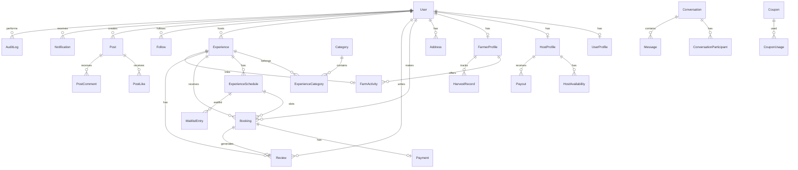

# Gatherly Entity Relationship Diagram

```mermaid
erDiagram
    User ||--o| UserProfile : has
    User ||--o| HostProfile : has
    User ||--o| FarmerProfile : has
    User ||--o{ Address : has
    User ||--o{ Booking : makes
    User ||--o{ Review : writes
    User ||--o{ Experience : hosts

    HostProfile ||--o{ HostAvailability : has
    HostProfile ||--o{ Payout : receives

    FarmerProfile ||--o{ FarmActivity : offers
    FarmerProfile ||--o{ HarvestRecord : tracks

    Category ||--o{ ExperienceCategory : contains
    Experience ||--o{ ExperienceCategory : belongs
    Experience ||--o{ ExperienceSchedule : has
    Experience ||--o{ Booking : receives
    Experience ||--o{ Review : has
    Experience ||--o| FarmActivity : links

    ExperienceSchedule ||--o{ Booking : slots
    ExperienceSchedule ||--o{ WaitlistEntry : waitlist

    Booking ||--o| Payment : has
    Booking ||--o| Review : generates

    User ||--o{ Follow : follows
    User ||--o{ Post : creates
    Post ||--o{ PostLike : receives
    Post ||--o{ PostComment : receives

    Conversation ||--o{ ConversationParticipant : has
    Conversation ||--o{ Message : contains

    Coupon ||--o{ CouponUsage : used
    User ||--o{ Notification : receives
    User ||--o{ AuditLog : performs
```

## Model Count: 40+

See `backend/prisma/schema.prisma` for the complete schema definition.
